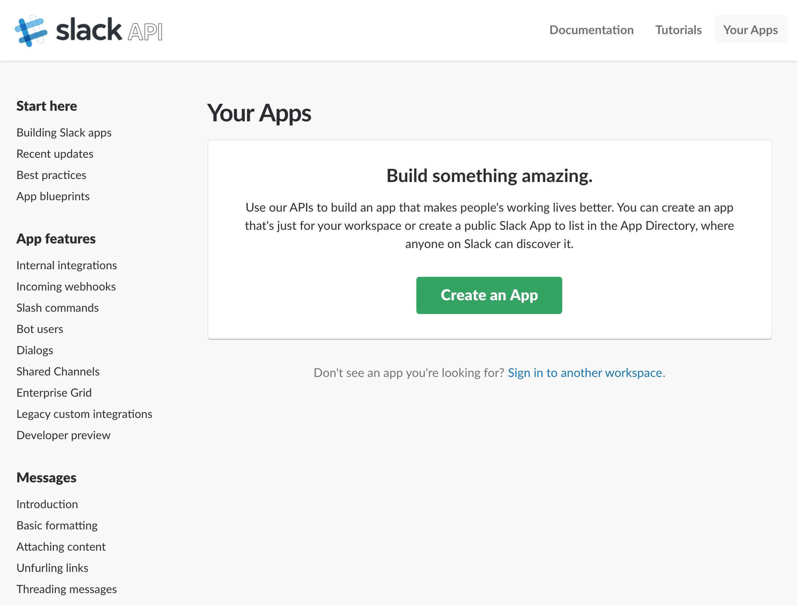
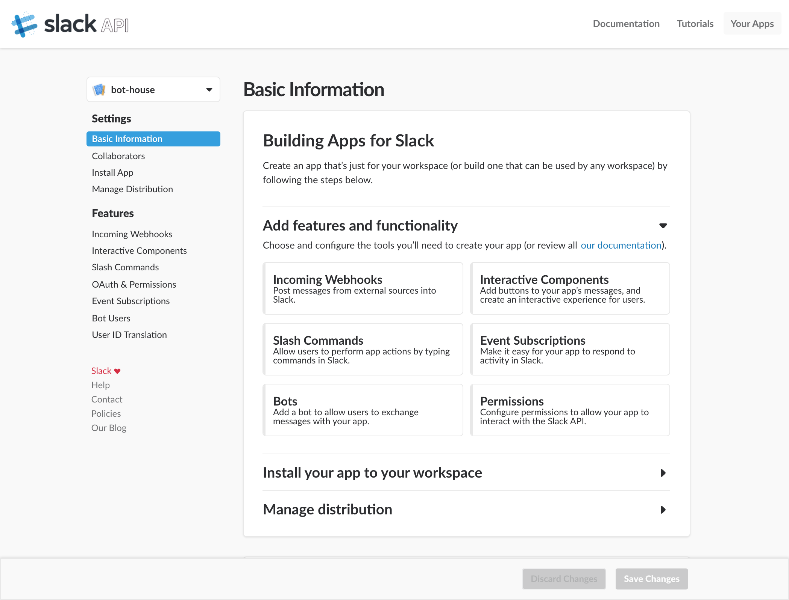
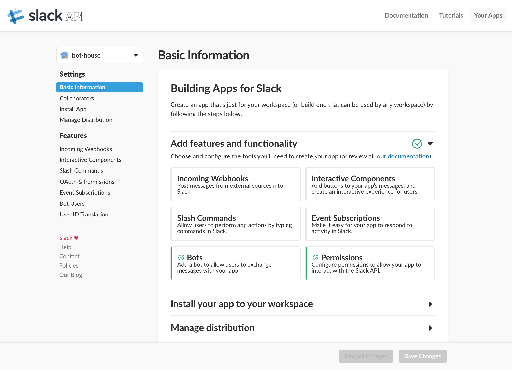
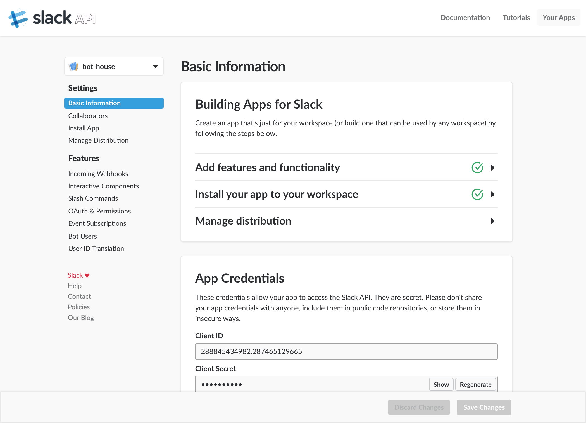
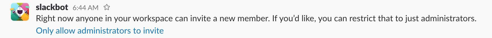
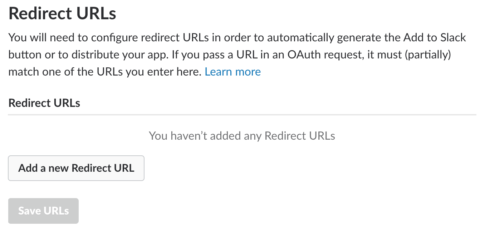

# Slack App Setup

## Slack App
First of all, go to https://api.slack.com/apps and click the `Create An App` button.

And then, can input `App Name` and `Development Slack Workspace` and click the `Create App` button.

Can see this screen if finish to click the `Create App` button.  

The items which set are as follows.

### Add features and functionality
It jumps to `https://api.slack.com/apps/<hash>/bots?` when select `Bots`.   
And then, add a Bot User.  
If created a bot, `Add features and functionality` is green.

### Install your app to your workspace
Click on `Install your app to your workspace` to jump to the authentication page and allow it.

Good :+1:

If allow it, will be notified by Slackbot.

### Set Redirect URL
Go to `OAuth Tokens & Redirect URLs` at `https://api.slack.com/<hash>/oauth?`.
Set Redirect URL for use on bot-house's authentication page.  

Write down the URL where bot-house is running.

## bot-house
This is a correspondence table of environment variables.

Go to https://api.slack.com/apps and select this app.  

### SLACK_BOT_TOKEN
`Bot User OAuth Access Token` is in `OAuth Tokens & Redirect URLs` at `https://api.slack.com/apps/<hash>/oauth?`.

### SLACK_CLIENT_ID
It is in `App Credentials` at `https://api.slack.com/apps/<hash>`.

### SLACK_CLIENT_SECRET
It is in `App Credentials` at `https://api.slack.com/apps/<hash>`.

### SLACK_TEAM_NAME
Write the team name on which this bot runs.